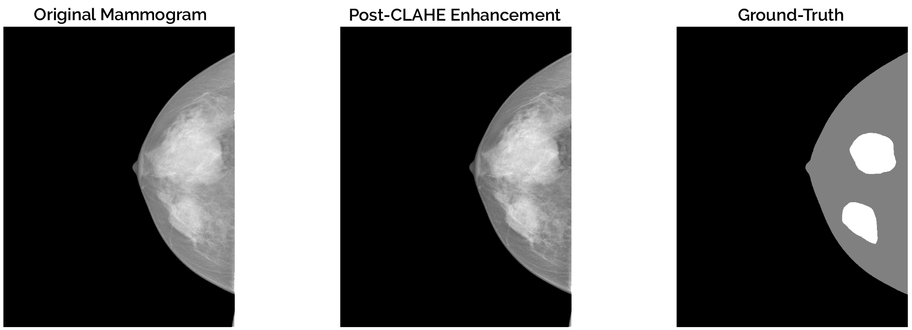
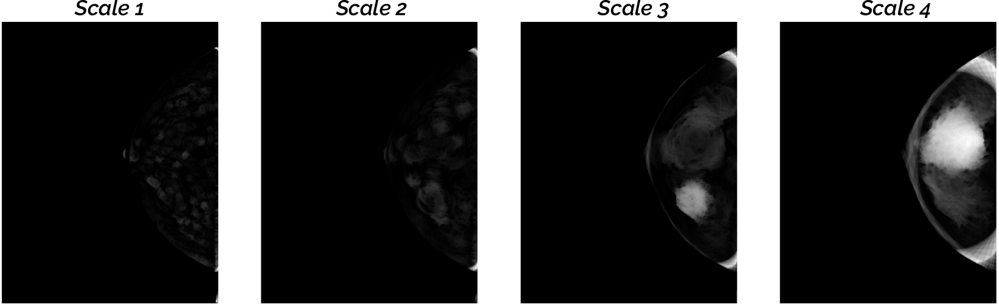
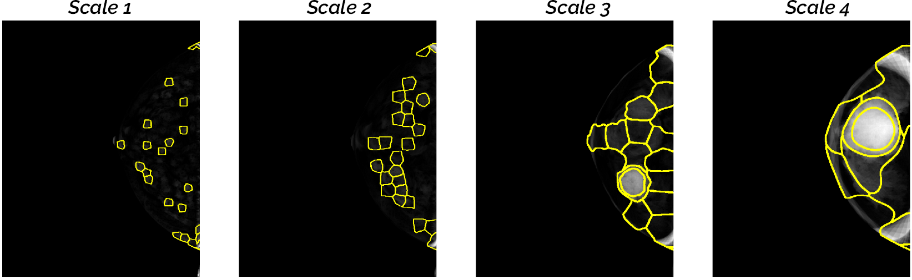
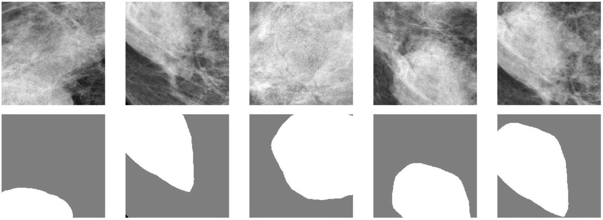

# Region Proposal Algorithms for Training Support Vector Machines and Convolutional Neural Networks

**Contributors**: Jaime Simarro Viana, Zohaib Salahuddin, Ahmed Gouda, Anindo Saha  

**Problem Statement**: Extract candidate regions of interest (ROI) for mass detection in mammograms, that are subsequently to-be-used for training a classifier (eg. *support vector machines*, *convolutional neural networks*, etc.) 
 
**Data**: *INbreast* Digital Mammographic Dataset - 115 cases (410 images).
 
## Preprocessing (*Contrast-Limited Adaptive Equalization)*

   
     
## Morphological Enhancement (*Multi-Scale Morphological Sifting*)  

    
## Region-Of-Interest Segmentation (*SLIC Superpixels*) 
 
 

## Patch Extraction (*Guided*)
 

## References
● Hang M. et al. (2019) "*Multi-Scale Sifting for Mammographic Mass Detection and Segmentation*", Biomedical Physics & Engineering Express, 5-2. DOI:10.1088/2057-1976/aafc07  
● Radhakrishna A. et al. (2010) "*SLIC Superpixels Compared to State-of-the-Art Superpixel Methods*", IEEE TPAMI. DOI:10.1109/TPAMI.2012.120  
● Moreira IC et al. (2012) "INbreast: Toward A Full-Field Digital Mammographic Database", Acad Radiol. 2012;19(2):236–248. doi:10.1016/j.acra.2011.09.014
